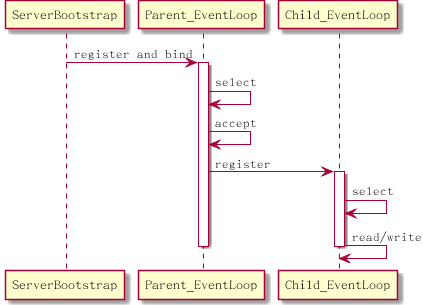

Date: 2014-07-19 18:30
Title: Netty代码分析 - NioEventLoop
Tags: Java "Server Side"
Category: Distributed Architecture

利用Java NIO提供的`multiplexing`和`non-blocking io`来处理网络请求, 可以在同一个线程内使用Selector处理多个网络连接, 节省了线程切换的开销，服务可以处理大量的并发连接, 程序的性能得到提升. 在Java NIO的基础上，*Netty*规划了线程模型和事件处理结构, 提供了抽象的接口来处理网络请求, 保证了程序的可靠性和高性能 ...

<!-- PELICAN_END_SUMMARY -->
和大多数的Java框架类似, *Netty*的设计非常复杂, 代码中存在大量的继承关系，并且定义了很多interface来抽象各个模块之间相互依赖的接口. 但是基本上Netty的设计结构还是逃不开并发编程常用的模式(`Patterns`). 本文基于Netty 4.X版本，主要关注`Event Loop`和`Thread Model`, 来分析基于Netty NIO的服务端设计和实现.

## Netty中的Concurrent Patterns
Netty中使用的最基础的pattern是[Reactor][1], `IO Multiplexing`由Netty来负责处理, 并提供了`Handler`的注册和调用机制. 当某一个channel(连接)有可以进行的操作`(OP_READ/OP_WRITE/OP_ACCEPT/OP_CONNECT)`时，Netty通过调用开发人员实现的Handler来进行处理. 通过使用[Rector][1]模式, 很好的隔离了底层的代码和上层的业务逻辑. 开发人员基本上只需要关心实现`Event Handler`. 另外，Netty在[Reactor][1]的基础上使用`Acceptor-Connector`模式，将连接的建立初始化与具体的IO操作分开到不同的Handler, 隔离和简化了实现逻辑.

Netty使用了多个线程来处理`Reactor`. 这有点类似于`Leader-Follower`模式, 在Netty中, 线程被包装在EventLoop中, 每一个EventLoop都会运行自己的`IO Multiplexing`. 当有可以处理的IO操作时，EventLoop会触发事件的派发, 并且调用注册的Event Handler, 也就是说Event Handler的调用是在当前的EventLoop的线程内进行的. `IO Multiplexing`和`Event Handle`的调用都是在EventLoop所在的线程, 这一点符合`Leader-Follower`模式, 但不同的是, 在Netty中, 进行连接建立的线程和处理`OP_READ/OP_WRITE`操作的线程是分开的. Netty中有两种EventLoop, `Parent EventLoop`来建立连接. 已建立的连接则会被放入到`Child EventLoop`中处理. 将`IO Multiplexing`和`Handler`的调用放到同一个线程中处理的方式被证明是高效的, 相比较与此相对的另外一种模式`Half-Sync Half-Async`, `Leader-Follower`模式避免了线程之间的数据同步，避免了CPU的切换和cache的失效. 在高并发的情况下, 能提供更高的效率. 

Netty支持NIO(`Nonblocking I/O`)和OIO(`Old Blocking I/O`)的IO模式, 但本文主要关注的是使用Netty NIO进行服务端开发的情况.

## NioEventLoop和NioEventLoopGroup
在Netty中, 进行`IO Multiplexing`并且处理`Handler`调用的模块被称为`EventLoop`:

    :::java
    class NioEventLoop{
        Selector selector;                              // selector for io multiplexing
        SelectedSelectionKeySet selectedKeys;           // selected keys
	    Thread thread;                                  // thread to run NioEventLoop.run
	    Executor executor;                              // executor that initialize the thread
	    Queue<Runnable> taskQueue;                      // task queue
	    Queue<ScheduledFutureTask<?>> delayedTaskQueue; // scheduled task queue
    }

前面提到过, NioEventLoop中包装了线程, 用来执行`IO Multiplexing`和`Event Handling`. 另外, `NioEventLoop`中还包含下面的三个成员:

- selectedKeys: 包含经过`select`之后, 有`ready`事件的key
- taskQueue: NioEventLoop除了运行`IO Multiplexing`和`Event Handling`之外, 还可以处理Task, 一些channel相关的任务可以放到这个queue里. 保证channel相关的操作都是在同一个`NioEventLoop`中执行.
- delayedTaskQueue: 用来保存定时的任务(scheduled task), 定时任务同样会在`NioEventLoop`中执行.

`NioEventLoop`初始化之后, 当开始往`NioEventLoop`中的taskQueue添加任务时, 这个操作会创建一个线程来执行`NioEventLoop`的`run`方法:

    #!java
	protected void run() {
	    for(;;) {
		    if(hasTask()) {
			    // if there is task in task queue, then just selectNow to ensure non-blocking
				selectNow()
			}
			else {
			    select(); // timeout will be the duration to first scheduled task.
			}

            processSelectedKeys();
			runAllTasks();
		}
	}

这个方法实际上就是[Reactor][1]模式中的`IO Multiplexing`和`Event Handling`部分. 在`run`方法中, NioEventLoop中会处理前面提到的三种操作:

* IO Multiplexing
* Task
* Scheduled Task

基本的思路是先找到所有可以运行的操作, 包括:

* 可以进行的IO操作(`OP_READ/OP_WRITE/OP_ACCEPT`)
* Task Queue中的Task
* 已经到运行时间的Scheduled Task

这里需要注意的有两点:

* 如果Task Queue中有Task, 那么会选择使用`selectNow`，这个版本的操作会检查当前可以进行的IO操作, 并立即返回.
* 当进行`select`操作时，timeout为最近可运行的Scheduled Task的运行时间.

上面的两点都是保证当有可运行的任务时，`EventLoop`不会在`IO Multiplexing`上做停留，而是尽快判断是否有可用的IO操作，然后开始进行事件分发和执行Task.

在进行`select`操作之后, `EventLoop`会调用`processSelectedKeys()`来处理已经ready的操作. 在这个函数中, 会判断当前的channel可以进行的操作, 并且根据可以进行的操作来调用对应的函数:

<!-- BEGIN RECEIVE ORGTBL select-invocation -->
| Operation | Invocation |
|---|---|
| READ/ACCEPT | `channel.unsafe().read()` |
| WRITE | `channel.unsafe().forceFlush()` |
<!-- END RECEIVE ORGTBL select-invocation -->

<!--
#+ORGTBL: SEND select-invocation orgtbl-to-markdown
| Operation   | Invocation                      |
|-------------+---------------------------------|
| READ/ACCEPT | `channel.unsafe().read()`       |
| WRITE       | `channel.unsafe().forceFlush()` |
-->

从跟上面的表格可以看出来, `OP_READ`和`OP_ACCEPT`操作都是调用相同的接口, 但实际上对应的channel类型不一样, 在`read()`函数中实现了不同的操作, 这个在后面会描述.

具有相同功能的多个`EventLoop`则组成一个`EventLoopGroup`. 类似下面的样子:

    :::java
	class NioEventLoopGroup {
	    private NioEventLoop[] children;
	}

前面提到`Netty`采用了Boss和Worker的方式来分别建立连接和数据, 实际上, `Netty`将线程封装在`NioEventLoop`来进行工作, `Netty`中别的模块看到的是`NioEventLoop`和`NioEventLoopGroup`. 可以将`NioEventLoopGroup`看成和Thread Pool类似的概念, 当channel注册到`NioEventLoopGroup`中时, `NioEventLoopGroup`会顺序分配group中的某一个`NioEventLoop`来完成注册, 随后channel的`select`将会交给分配到的`NioEventLoop`来完成.

## Socket Accept

当有了`EventLoop`之后, 需要做的就是将连接注册到`EventLoop`中，在Server端, 这个操作通过`ServerBootstrap`开始触发, 首先, `ServerBootstrap`会进行下面的初始化工作.

- 创建并设置Boss EventLoop Group和Worker EventLoop Group
- 设置channel使用的class为NioServerSocketChannel
- 设置Handler
- 设置Child Handler

在这里, 本文只描述class为`NioServerSocketChannel`的情况, `NioServerSocketChannel`支持对其进行`bind`和`accept`操作. 在进行初始化工作之后, `bootstrap`开始进行`EventLoop`注册和`Channel`绑定操作, 分为三个步骤:

- 初始化channel, 在这个步骤, `NioServerSocketChannel`会被创建, 并且根据`bootstrap`时指定的option进行初始化. 初始化之后再将`ServerBootstrapAcceptor`注册作为该`channel`的Event Handler.
- 初始化之后, 该`channel`会被注册到Boss EventLoop Group. 如前面所描述, 这个操作实际上是将`channel`和Boss EventLoop Group中的某一个Event Loop进行绑定.
- 在注册绑定之后, `channel`最后进行绑定操作, 将该channel绑定到指定的端口.

在前面描述`EventLoop`的时候提到, 经过`select`之后, 如果有`ready`的事件, `EventLoop`首先会调用channel中的不同函数来完成操作, 在这里, 如果是`OP_ACCEPT`操作, 那么实际上会调用`NioServerSocketChannel.unsafe().read()`. `read()`函数会做下面的两个步骤来完成这次`OP_ACCEPT`事件:

- 循环调用`javaChannel().accept()`来完成接受连接的建立(可能有多个`OP_ACCEPT`操作)
- 在每一次`accept`操作之后, 调用`pipeline.fireChannelRead()`发出`channelRead`事件.
- 循环结束之后调用`pipeline.fireChannelReadComplete`来发出`channelReadComplete`事件.

前面`bootstrap`的过程已经将`ServerBootstrapAcceptor`注册为`channel`的Event Handler, 因此在这里当`accept`操作之后发出`channelRead`事件时, 会调用`ServerBootstrapAcceptor`的`channelRead`方法:

    #!java
	public void channelRead(ChannelHandlerContext ctx, Object msg) {
        final Channel child = (Channel) msg;
        child.pipeline().addLast(childHandler); // 注册在bootstrap时设置的channelHandler

        // 将child注册到 worker EventLoopGroup
        childGroup.register(child);
    }

上面是一个简化的版本, 从代码中可以看出来, `accept`之后的`channel`作为`msg`参数被传入到函数中, 这个`channel`在函数中被称为`child`. 函数做了下面的两件事情:
- 将`bootstrap`时指定的`childHandler`注册为`child`的Event Handler
- 将`child`注册到Worker EventLoopGroup中.

这之后, `child channel`将由某一个选定的 EventLoop进行处理.

## Socket Read
了解了Socket Accpet的过程之后, Socket Read的过程就比较容易理解了, 两者基本上是相同的流程, 不同的是, Socket Accept是在Boss EventLoop中进行处理, 而Socket Read是在Worker EventLoop中进行处理:

- 当socket的另一端写入数据, 那么channel对应的EventLoop会`select`到`OP_READ`事件.
- EventLoop会调用`NioSocketChannel.unsafe().read()`, 该函数会循环调用`channel`的`read`操作, 读取数据到buf中
- 每一次read操作之后会发出`channelRead`事件, 并调用各个Event Handler进行处理.
- 当循环结束之后, 发出`channelReadComplete`事件.

## EventLoop 总结
根据上面的描述, 在Netty中, 实际上有两种类型的EventLoop:

- `Parent EventLoop` : 负责处理`NioServerSocketChannel`, 主要是`OP_ACCEPT`操作
- `Child Eventloop` : 负责处理`NioSocketChannel`, 主要处理`OP_WRITE/OP_READ`操作

通过使用`EventLoopGroup`, 每一种EventLoop都可以有多个实例(在`bootstrap`的时候指定). 

在Server端使用NIO的情况下, Parent EventLoop和Child EventLoop的协作方式如下面的图所示:

- 首先是在`bootstrap`的时候在进行register和bind操作的时候, 会将创建的`NioServerSocketChannel`注册到`Parent EventLoop`中.
- 当有客户端连接时, `Parent EventLoop`会"select"到`OP_ACCEPT`操作, 如前面的描述, `Parent EventLoop`会调用`NioServerSocketChannel`的`read`方法来`accept`连接, 然后通过`ServerBootstrapAcceptor`将新的`NioSocketChannel`注册到`Child EventLoop`.
- 当客户端通过连接发送数据时, `Child EventLoop`会"select"到`OP_READ`操作, 这时候`Child EventLoop`会调用`NioSocketChannel`的`read`操作来读取数据, 并且触发`channelRead`和`channelReadComplete`事件.

## Reference

1. [http://en.wikipedia.org/wiki/Reactor_pattern](http://en.wikipedia.org/wiki/Reactor_pattern)
2. [http://xw-z1985.iteye.com/blog/1918052](http://xw-z1985.iteye.com/blog/1918052)
3. [Netty in Action](http://www.manning.com/maurer/)

[1]: http://en.wikipedia.org/wiki/Reactor_pattern "Reactor"
[2]: http://xw-z1985.iteye.com/blog/1918052 "Netty 4.x 源码分析"
